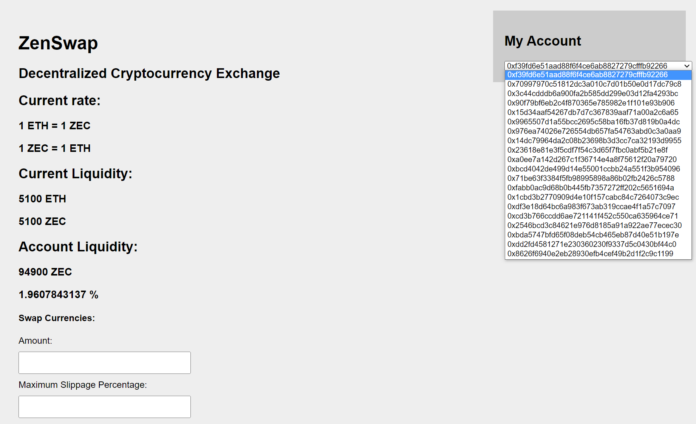

## Stanford University, CS251 Project 4: Building a DEX

Install package

```
yarn install
```

Run a local Ethereum network node

```
yarn hardhat node
```

Deploy token smart contract on local network

```
yarn hardhat run scripts/deploy_token.js --network localhost
```

Copy your token smart contract's address and paste in `contracts/exchange.sol` . After that, deploy exchange contract on local network

```
yarn hardhat run scripts/deploy_token.js --network localhost
```

Copy your abi, smart contract's address (You can find them in folder `artifacts/contracts/contract_name.sol`)

Run `web_app/index.html`


